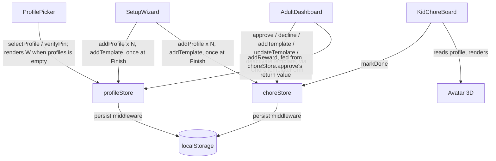

# BROski Chores — Architecture

This describes what's actually built. For *why* it's shaped this way, see the design specs (one per version) linked from README's [Design history](README.md#design-history) section — starting with
[`docs/superpowers/specs/2026-07-26-household-chores-v1-design.md`](docs/superpowers/specs/2026-07-26-household-chores-v1-design.md) for the core architecture below.

## 1. System shape

There is no backend. Everything below runs entirely in the browser.

**The one deliberate coupling rule:** `profileStore` and `choreStore` never import each other. `AdultDashboard.jsx` is the sole bridge — it calls `choreStore.approve(instanceId)`, which returns `{ profileId, coinReward, xpReward } | null` as plain data, and only then calls `profileStore.addReward(...)` with that data. Neither store has any awareness the other exists. `SetupWizard.jsx` calls both stores directly (never through `AdultDashboard`), but only ever inside a single `handleFinish` function — nothing is written to either store while the wizard is still being filled in, only once, at the end.

## 2. Data flow: completing a chore

1. `App.jsx` generates today's `ChoreInstance`s from active `ChoreTemplate`s once on mount (idempotent — safe even if called again, e.g. by React StrictMode's double-invoke in dev).
2. A kid taps "Done" on `KidChoreBoard` → `choreStore.markDone(instanceId, profileId)` → instance status `open → pending`.
3. An adult opens `AdultDashboard`, sees the instance in the approval queue, taps Approve → `choreStore.approve(instanceId)` flips status to `approved` and returns the reward → `profileStore.addReward(profileId, { coins, xp })` credits it and recomputes level.
4. If the reward crosses a level threshold, `addReward` sets `justLeveledUp: true` on that profile.
5. Next time that kid's board mounts, `Avatar.jsx` sees `justLeveledUp === true`, plays a pulse animation (curve computed by the pure `pulseScale()` function in `src/lib/avatarAnimation.js`, no DOM/Three.js dependency — fully unit-testable), then calls `clearLevelUpFlag`.

## 2a. Reward snapshotting (why editing a chore mid-day is safe)

A `ChoreInstance` carries its own `coinReward`/`xpReward`, copied from the template at the moment `generateTodaysInstances` creates it — it is not resolved live from the template at approval time. `approve()` reads `instance.coinReward ?? template.coinReward` (same for xp): the instance's own snapshot wins whenever it exists, and the `??` fallback exists permanently for any instance that predates this snapshot field (this store is `persist`ed — an already-running household's saved data has instances with no such field). This is why an adult editing a chore's reward at 3pm never changes what a kid gets paid for a chore they already marked done that morning, and why the *displayed* reward on both `AdultDashboard`'s pending queue and `KidChoreBoard`'s chore card also reads the instance snapshot, not the live template — display and payout must agree, or a kid sees one number and gets paid another.

## 2b. Template management lifecycle

`choreStore.updateTemplate(id, patch)` and `deactivateTemplate(id)` (reactivating is just `updateTemplate(id, { active: true })` — there's no separate action for it) are called from `AdultDashboard.jsx` via a shared `ChoreTemplateForm.jsx` component (same form for add and edit, normalizing both call shapes into one internal state up front). Every mutating action — add, edit-save, deactivate, reactivate — re-triggers `generateTodaysInstances(...)` immediately afterward, because `App.jsx`'s own call to it only ever fires once, on first mount. `generateTodaysInstances` is idempotent per template+date, so calling it again after every mutation is always safe, never produces a duplicate, and correctly produces today's instance right away if a reactivated (or newly daily-applicable) template applies today. Deactivating a template never touches an already-generated instance — a kid mid-chore or with a pending approval keeps seeing it; deactivation only stops *new* instances from being generated tomorrow onward.

`ChoreTemplateForm.jsx` also accepts an optional `kidsOverride` prop (an array of `{id, name}`), used only by `SetupWizard.jsx` — it lets the wizard's optional first-chore step show *draft* kids (not yet real profiles) in the assignee dropdown before any profile exists in the store. When omitted, the form reads kids from `profileStore` as normal; both `AdultDashboard.jsx` call sites omit it.

## 3. State ownership

| Store | Owns | Persisted under |
|---|---|---|
| `profileStore` | Profiles, PINs, coins/xp/level, `justLeveledUp` | `broski_chores_profiles_v1` (Zustand `persist`) |
| `choreStore` | Templates, daily instances, lifecycle status | `broski_chores_chores_v1` (Zustand `persist`) |
| `uiStore` | Generic notifications/modal state | not persisted |

`src/lib/storage.js` is a small standalone `localStorage` read/write helper, kept for any future code that needs manual persistence outside a Zustand store — neither current store uses it, since `persist` already handles that lifecycle correctly for them.

## 4. Routing

Three routes via React Router v6, all defined in `App.jsx`:

- `/` — `ProfilePicker`
- `/kid` — `KidChoreBoard`
- `/adult` — `AdultDashboard`

`AdultDashboard`'s route guard checks that the *currently selected profile's role* is `'adult'` (not just that some profile is selected) — this closes a real bug found during a whole-branch review, where a kid picking their own profile could still reach `/adult` via the Back button, URL bar, or session restore.

**No fourth route for setup.** `ProfilePicker` conditionally renders `SetupWizard` in place of its normal grid whenever `profileStore.profiles.length === 0`, rather than the wizard living at its own path — a household lands on `/` either way, and the instant any profile exists, the condition is false forever and `SetupWizard` never renders again. This was a deliberate choice to avoid a router-level "have I completed setup" flag that could drift out of sync with the actual store state; `profiles.length` can't drift, it just *is* the answer.

## 5. Testing

Vitest + React Testing Library. Every store and component has a colocated `__tests__` file. Pure logic (`pulseScale`, `classifyEngagement`-style decision functions) is extracted so it can be tested with plain data, no DOM. There is no E2E test framework in this repo and no CI pipeline configured — `npm test` is run locally.

## 6. Build

Standard Vite build, `npm run build` outputs to `dist/`. `vite.config.js`'s `manualChunks` splits `react`/`three`/`utils` into separate bundles; the `three` chunk exceeds Rollup's default 500kB warning threshold (react-three-fiber + drei pull in a meaningful chunk of Three.js) — this is expected for a 3D-avatar app and not something this repo currently addresses with lazy-loading.

## 7. What this app deliberately does not have

- No authentication, no accounts, no login — profiles are picked by tap, adults gated by a plain-string PIN comparison (a household speed bump, explicitly not a security boundary).
- No backend, no database, no REST or WebSocket API.
- No error-tracking service, no analytics, no monitoring.
- No CI/CD pipeline.

These aren't omissions to fix — they're the point. See the design spec's Non-goals section.
